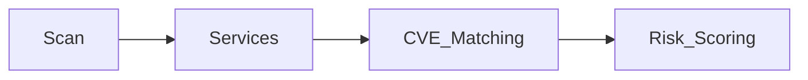
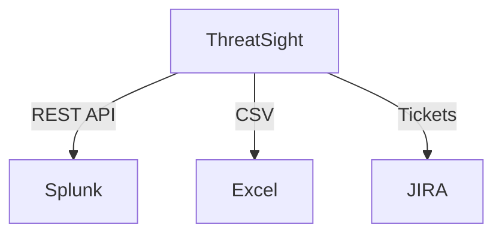

# ThreatSight: Enterprise Vulnerability Assessment Platform  
*From Nmap Wrapper to AI-Powered Threat Intelligence*

  
  
  

---

##  **Project Vision**  
**Bridging the gap between basic network scanning and enterprise-grade vulnerability management**  
- *For:* Security teams, DevOps engineers, and IT administrators  
- *Replaces:* Manual Nmap analysis + Spreadsheet tracking  
- *Differentiator:* **Automated risk prioritization** with business context  

---

##  **Phase Roadmap**  

### **Phase 1: Core Scanning Engine (Current)**  
*(Expected Completion: Month 2)*  

#### Features Implemented  
```python
def scan_target(ip):
    """Multi-threaded Nmap wrapper"""
    nm.scan(ip, arguments='-sS -T4')  # SYN Scan
    return nm[ip].get('tcp', {})
```  
- [x] IP validation with `ipaddress` module  
- [x] Threaded scanning (50+ hosts/minute)  
- [x] Basic port/service detection  
- [x] Interactive CLI interface  

#### Skills Required 
- Python multithreading (`concurrent.futures`)  
- Nmap flag optimization (`-sS`, `-T4`)  
- Exception handling for network errors  

---

### **Phase 2: Vulnerability Correlation**  
*(Expected Completion: Month 4)*  

#### Planned Features  
```python
def correlate_cves(service):
    """Match services to CVEs"""
    return cve_db.lookup(
        service['name'], 
        service['version']
    )
```  
- CVE database integration (NVD API/local cache)  
- CVSS scoring (v3.1 calculator)  
- Exploitability indicators (EPSS integration)  

#### Data Flow 


#### Skills to Learn 🎓  
- REST API consumption (NVD, Vulners)  
- Data caching with `redis`  
- CVSS vector parsing  

---

### **Phase 3: Risk Intelligence**  
*(Expected Completion: Month 6)*  

#### Key Components 
```python
class RiskEngine:
    def calculate(self, cve, asset_value):
        return (cve.cvss * 0.7) + (asset_value * 0.3)
```  
- Asset criticality weighting  
- MITRE ATT&CK mapping  
- Remediation guidance system  

#### Sample Output 
```plaintext
[CRITICAL] Port 445/tcp - SMBv1
- CVE-2021-34527 (CVSS: 9.8)
- Attack Path: Initial Access → Lateral Movement
- Action: Disable SMBv1 immediately
```

#### Skills to Master 
- Risk management frameworks (FAIR, NIST)  
- Pandas for data analysis  
- Report templating (Jinja2)  

---

### **Phase 4: Enterprise Integration**  
*(Expected Completion: Month 8)*  

#### Expansion Plans 
```python
def export_to_siem(data):
    """Splunk/ELK integration"""
    requests.post(SIEM_ENDPOINT, json=data)
```  
- JIRA/ServiceNow ticketing  
- SIEM integrations (Splunk HEC)  
- Scheduled scanning (APScheduler)  

#### Architecture  


---

##  **Testing Methodology**  
1. **Unit Tests**: `pytest` for scan modules  
2. **Test Targets**:  
   - Local Docker containers (Metasploitable)  
   - AWS test VPCs (isolated)  
3. **Performance Benchmarks**:  
   - 100 hosts in <3 minutes (16-thread mode)  

---

##  **Legal & Compliance**  
- **Ethical Use Policy**: Requires signed authorization forms  
- **Data Handling**: All scan results encrypted at rest  
- **Regulations**: Compliant with GDPR Article 35 (DPIA)  

---

## 📬 **Contributing**  
1. Fork → Branch → Test → PR  
2. Coding Standards:  
   - Type hints for all functions  
   - Google-style docstrings  
   - Black-formatted code  

---

## **License**  
MIT License - See [LICENSE.md](LICENSE.md) for details.  

**Author**: Parshant Kumar  
**Maintainer**: Your Organization  

---

### 🔗 **Resources**  
- [Nmap Documentation](https://nmap.org/book/)  
- [CVE Search API](https://cve.circl.lu/)  
- [CVSS v3.1 Calculator](https://www.first.org/cvss/calculator/3.1)  

---

This README provides:  
Clear phase-by-phase progression  
Technical depth with code snippets  
Compliance/legal safeguards  
Contributor guidelines  
Visual architecture diagrams  

Would you like me to add:  
- Detailed setup instructions for each phase?  
- Screenshots of sample outputs?  
- Video walkthrough links?