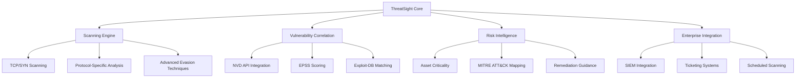
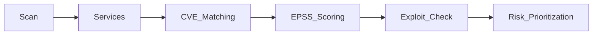
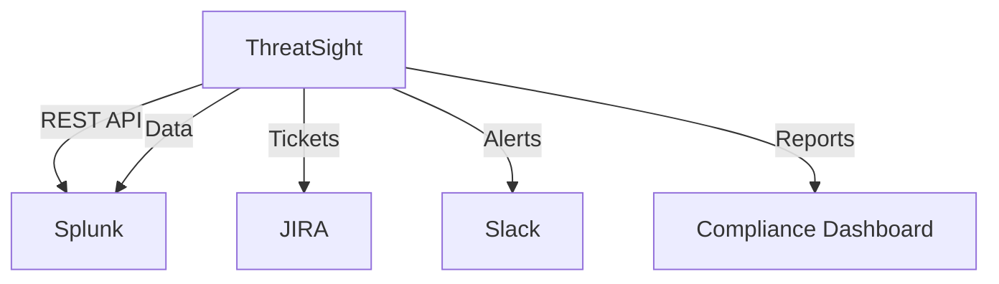

# ThreatSight: Enterprise Vulnerability Assessment Platform  
*From Nmap Wrapper to AI-Powered Threat Intelligence*

  
  


---

## **Project Vision**  
**Bridging the gap between basic network scanning and enterprise-grade vulnerability management**  
- *For:* Security teams, DevOps engineers, and IT administrators  
- *Replaces:* Manual Nmap analysis + Spreadsheet tracking  
- *Differentiator:* **Automated risk prioritization** with business context and AI-powered threat intelligence

---

## **Architecture Overview**



---

## **Phase Roadmap**  

### **Phase 1: Advanced Scanning Engine (Current)**  
*(Expected Completion: Month 2)*  

#### Features Implemented  
```python
def scan_target(target, scan_type="hybrid"):
    """Advanced scanning with multiple techniques"""
    if scan_type == "syn":
        return syn_scan(target)  # Raw socket SYN scanning
    elif scan_type == "stealth":
        return stealth_scan(target)  # Evasion techniques
    elif scan_type == "protocol":
        return protocol_specific_scan(target)  # Modbus/MQTT/etc
```

- [x] Multi-threaded and asynchronous scanning architecture
- [x] TCP Connect, SYN, and UDP scanning implementations
- [x] Protocol-specific scanning (Modbus TCP, MQTT, HTTP/S)
- [x] Advanced evasion techniques (source randomization, packet fragmentation)
- [x] OS fingerprinting via TCP/IP stack analysis
- [x] Intelligent banner grabbing with service-specific probes

#### Skills Required 
- Advanced Python concurrency (`asyncio`, `multiprocessing`)
- Raw socket programming and packet crafting
- Protocol analysis (Industrial, IoT, Web)
- Evasion technique implementation

---

### **Phase 2: AI-Powered Vulnerability Correlation**  
*(Expected Completion: Month 4)*  

#### Planned Features  
```python
def analyze_vulnerabilities(scan_results):
    """AI-enhanced vulnerability assessment"""
    cves = nvd_api.lookup(scan_results)
    epss_scores = get_epss_prediction(cves)
    exploits = search_exploit_db(scan_results)
    
    return prioritize_vulnerabilities(cves, epss_scores, exploits)
```  
- NVD API integration with local caching
- EPSS scoring for exploit prediction
- Exploit-DB and Metasploit integration
- Machine learning for false positive reduction
- CVSS v3.1 scoring with environmental metrics

#### Data Flow 


#### Skills to Learn 
- REST API consumption (NVD, Vulners, Exploit-DB)
- Machine learning for security analytics
- Data caching with Redis
- CVSS vector parsing and environmental metrics

---

### **Phase 3: Intelligent Risk Assessment**  
*(Expected Completion: Month 6)*  

#### Key Components 
```python
class RiskIntelligenceEngine:
    def assess_risk(self, vulnerability, asset_context):
        """Context-aware risk assessment"""
        base_score = vulnerability.cvss_score
        asset_value = asset_context.get_criticality()
        exploit_probability = vulnerability.epss_score
        business_impact = self.calculate_business_impact()
        
        return (base_score * 0.4) + (asset_value * 0.3) + 
               (exploit_probability * 0.2) + (business_impact * 0.1)
```  
- Asset criticality weighting with business context
- MITRE ATT&CK technique mapping
- Automated remediation guidance system
- Predictive analytics for emerging threats

#### Sample Output 
```plaintext
[CRITICAL] Port 445/tcp - SMBv1 (CVE-2021-34527)
- CVSS: 9.8 | EPSS: 0.97 | Asset Criticality: High
- Attack Path: Initial Access → Lateral Movement
- MITRE Techniques: T1210, T1570
- Action: Disable SMBv1 immediately (Priority: P0)
- Estimated Remediation Time: 2 hours
```

#### Skills to Master 
- Risk management frameworks (FAIR, NIST RMF)
- Pandas for security data analysis
- Report templating with Jinja2
- Business impact analysis techniques

---

### **Phase 4: Enterprise Integration & Automation**  
*(Expected Completion: Month 8)*  

#### Expansion Plans 
```python
def enterprise_workflow(scan_results):
    """Full enterprise integration pipeline"""
    tickets = jira.create_tickets(scan_results)
    splunk.ingest_data(scan_results)
    slack.send_alerts(high_risk_vulns)
    generate_compliance_reports(scan_results)
```  
- JIRA/ServiceNow ticketing with automated prioritization
- SIEM integrations (Splunk HEC, Elasticsearch)
- ChatOps integration (Slack, Microsoft Teams)
- Scheduled scanning with APScheduler
- Compliance reporting (PCI DSS, HIPAA, ISO 27001)
- REST API for integration with other security tools

#### Architecture  


---

### **Phase 5: AI-Enhanced Features**  
*(Expected Completion: Month 12)*  

#### Advanced Capabilities
```python
def predict_attack_paths(scan_results):
    """AI-powered attack path prediction"""
    return ml_model.predict(
        scan_results, 
        network_topology, 
        asset_criticality
    )
```
- Attack path simulation and prediction
- Zero-day vulnerability prediction
- Automated patch management guidance
- Natural language report generation
- Threat hunting query recommendations

---

## **Testing Methodology**  
1. **Unit Tests**: `pytest` for all modules with >90% coverage
2. **Integration Tests**: Docker-compose environments with vulnerable containers
3. **Test Targets**:  
   - Metasploitable, DVWA, and custom vulnerable applications
   - Industrial control system simulations (Modbus, BACnet)
   - IoT device emulations
4. **Performance Benchmarks**:  
   - 1,000 hosts in <5 minutes (distributed scanning mode)
   - 100+ concurrent vulnerability assessments

---

## **Legal & Compliance**  
- **Ethical Use Policy**: Requires signed authorization forms
- **Data Handling**: All scan results encrypted at rest (AES-256)
- **Regulations**: Compliant with GDPR Article 35 (DPIA), CCPA, HIPAA
- **Responsible Disclosure**: Built-in mechanisms for ethical reporting

---

## **Contributing**  
1. Fork → Branch → Test → PR  
2. Coding Standards:  
   - Type hints for all functions  
   - Google-style docstrings  
   - Black-formatted code  
   - Security-focused code reviews
3. Development Environment:
   - Pre-commit hooks for code quality
   - Dockerized development environment
   - Automated security scanning of code

---

## **License**  
MIT License - See [LICENSE.md](LICENSE.md) for details.  

**Author**: Parshant Kumar  

---

## **Resources**  
- [Nmap Documentation](https://nmap.org/book/)  
- [NVD API Documentation](https://nvd.nist.gov/developers/vulnerabilities)  
- [EPSS API Documentation](https://www.first.org/epss/api)  
- [MITRE ATT&CK Framework](https://attack.mitre.org/)  
- [CVSS v3.1 Specification](https://www.first.org/cvss/v3.1/specification-document)

---

## **Getting Started**

```bash
# Clone the repository
git clone https://github.com/yourusername/threatsight.git
cd threatsight

# Set up virtual environment
python -m venv venv
source venv/bin/activate  # Linux/Mac
# or
venv\Scripts\activate  # Windows

# Install dependencies
pip install -r requirements.txt

# Run basic scan
python threat_sight.py 192.168.1.0/24 --stealth --output report.html
```

For detailed documentation, see our [Wiki](https://github.com/yourusername/threatsight/wiki).